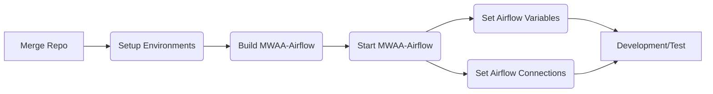

<!-- PROJECT LOGO -->
<br />
<p align="center">
<a href="https://github.com/jeffersonroth/shiru-flow">
  
</a>

<h3 align="center">Airflow Plugins and Utils for MWAA</h3>

<p align="center">
  This repo is intended to be used mainly by Big Data and Business Intelligence Competency Central (BICC) teams.
</p>

<!-- TABLE OF CONTENTS -->
<details open="open">
  <summary>Table of Contents</summary>
  <ol>
    <li>
      <a href="#about-the-repository">About The Repository</a>
    </li>
    <li>
      <a href="#contributing">Contributing</a>
    </li>
    <li>
      <a href="#getting-started">Getting Started</a>
    </li>
    <li>
      <a href="#development">Development</a>
    </li>
    <li>
      <a href="#documentation">Documentation</a>
    </li>
    <li>
      <a href="#usage">Usage</a>
    </li>
    <li><a href="#contact">Contact</a></li>
  </ol>
</details>

<!-- ABOUT THE REPOSITORY -->

## About the Repository

<p align="center">


This repository has the necessary tools to setup a fully functioning image of Airflow locally (Docker).
The src folder will have all the code to be deployed to S3 MWAA Plugins folder.

The plugins will be developed for MWAA 2_2 (Airflow `2.2.2`, Python `3.7`).

<!-- CONTRIBUTING -->

## Contributing

Merge your pull requests to **development**. Once it's ready to be deployed to production, merge the development branch into the **main** branch.

<!-- GETTING STARTED -->

## Getting Started



### Setup Environments

#### Setup .env files

> Create the `./.env` file based on `./.env.example`.

It'll at least have the following information:

- **ENV**
  - Environment: `test` | `development`
- **AIRFLOW_VERSION**
  - Must match MWAA. Current: `2.2.2`
- **PYTHON_VERSION**
  - Must match MWAA. Current: `3.7.13`
- **PYTHON_VENV**
  - Must match the virtual environment name you created. Example: `shiru-flow`
- **POSTGRES_HOST**
  - If local database (localhost): `host.docker.internal`
- **POSTGRES_PORT**
  - If local database (localhost), it's the port used inside of docker. Example: `5432`
- **POSTGRES_PORT_FORWARD**
  - If local database (localhost), it's the final exposed port. Example: `54351`
- **POSTGRES_USERNAME**
  - If local (localhost), must match `development/docker-compose.yaml`
- **POSTGRES_PASSWORD**
  - If local (localhost), must match `development/docker-compose.yaml`

```sh
cp ./development/.env.example ./development/.env
```

#### Setup Python's virtual env

> We highly recommend having a exclusive venv for this project. You can run (or create your own script from):

```sh
source ./development/scripts/setup_venv_pyenv.sh
```

<!-- DEVELOPMENT -->

## Development

### Structure:

> The code (plugins) to be exported to your project's S3 bucket is inside `./src/plugins` folder.

> The code (dags) to test the plugins are located in `./src/dags` folder.

> The local logs are located in `./src/logs` folder.

> The Docker files for local development are located in `./src/docker` folder.

> The scripts are located in `./src/scripts` folder.

> The Airflow Variables are located in `./src/variables` folder.

#### plugins

> The `plugins` folder contains the plugins available to be used in the dags. Any change to this folder should automatically generate a new `plugins.zip` file after commit (TODO).

Documentation [here](https://airflow.apache.org/docs/apache-airflow/stable/plugins.html).

Examples [here](https://github.com/airflow-plugins/Example-Airflow-DAGs).

#### dags

> The `dags` folder contains all the code to run the dags that'll be used to test the plugins, including python code, bash scripts, sql files, and any other script or files that could be executed by any type of operator (Custom, Python, Bash, S3, Postgres, JDBC, k8s, and many [others](https://airflow.apache.org/docs/apache-airflow-providers/operators-and-hooks-ref/index.html)).


#### logs

> The `logs` folder stores all the logs written by Airflow. It's not versioned, that means it'll only contain your local logs.

Documentation [here](https://airflow.apache.org/docs/apache-airflow/stable/logging-monitoring/index.html).

#### docker

> The `docker` folder contains all the necessary infrastructure for running a Docker container mocking MWAA.

> The Python requirements are located in `requirements` folder.

For more details, see the original [documentation](https://github.com/aws/aws-mwaa-local-runner).

#### Data Infrastructure projects (Big Data)

Complete list of providers [here](https://airflow.apache.org/docs/apache-airflow-providers/packages-ref.html).

Tutorial on how to create your own operator [here](https://airflow.apache.org/docs/apache-airflow/stable/howto/custom-operator.html).

Core Extensions info [here](https://airflow.apache.org/docs/apache-airflow-providers/core-extensions/index.html).

<!-- USAGE -->

## Usage

> Find below how to use each specific plugin.

### (dbt)[src/plugins/dbt]

<p align="center">


> Plugin that run dbt models.

> Example usage: (test_dbt_dag.py)[src/dags/dbt/test_dbt_dag.py]

#### Variables

##### **VARIABLE_NAME**

> ...

<!-- DOCUMENTATION -->

## Documentation

> Every dag, task, and objects shall have a .md file associated in the documentation folder, with brief documentation, and diagrams (if apply).

<!-- CONTACT -->

## Contact

Jefferson Johannes Roth Filho (Shiru) - jjrothfilho@gmail.com
